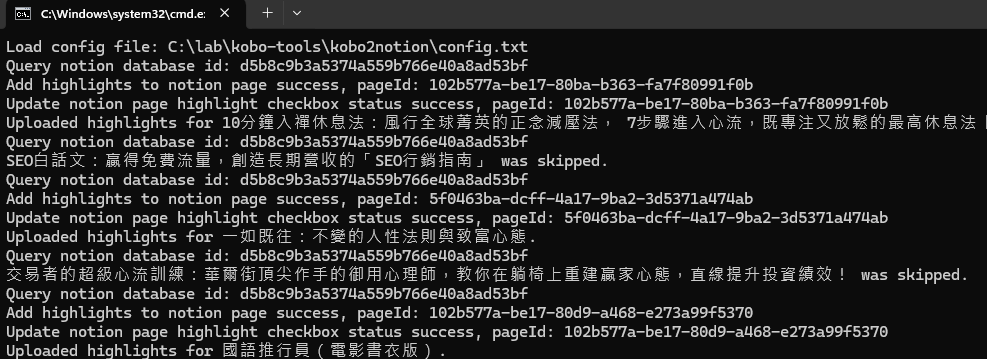
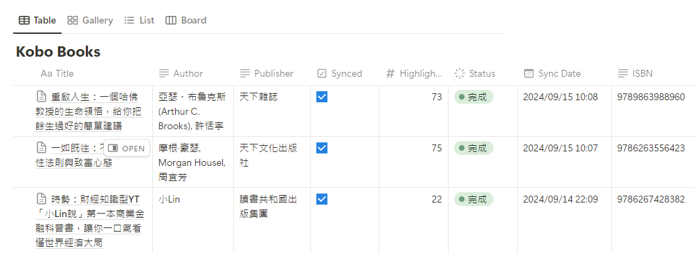

# Kobo2Notion


*此圖片由 DALL·E 生成。*

`kobo2notion` 是一個將 Kobo 電子書閱讀器上的 highlight 標記自動匯出至 Notion 資料庫的工具。這個專案包含 Windows Batch 檔案、PowerShell 腳本以及一個簡單的設定檔，讓使用者可以輕鬆整合他們的閱讀資料。

## 功能

- 匯出 Kobo 的 highlight 標記至 Notion 資料庫
- 自動查找 Notion 中的書籍頁面並更新 Highlight 標記內容與書籍的基本資料，如出版社、作者、ISBN
- 支援批量處理多本書籍
- 自動安裝缺少的 PowerShell 模組
- 可自定義 Notion API token 與資料庫 ID

## 專案背景

此專案的參考原型來自於 GitHub 上的 [export-kobo-to-notion](https://github.com/juliariec/export-kobo-to-notion) 專案。`kobo2notion` 的開發目的是希望能夠在 Windows 系統上無痛運行，無需額外安裝 Python 或 Node.js 等工具。透過使用 Windows 批次檔和 PowerShell 腳本，以提供 Windows使用者簡單的使用方式和最小的設置步驟。

## 檔案結構

- **kobo2notion.bat**: Windows Batch 檔案，負責執行 PowerShell 腳本。
- **kobo2notion.ps1**: PowerShell 腳本，負責從 Kobo 數據庫讀取 highlight 並將其匯出至 Notion。
- **config.txt**: 設定檔，包含 Notion API token、Notion 資料庫 ID 與 Kobo 數據庫的路徑。

## 前置準備

- Windows 作業系統
- PowerShell 5.1 或更新版本
- Notion API Token（需自行註冊 Notion API Integration）
- Kobo 資料庫檔案（通常為 `KoboReader.sqlite`）
- Notion 資料庫設定具有以下基本欄位：Title(text), Author(text), Publisher(text), Synced(checkbox), Highlight Count(number), Sync Date(date), and ISBN(text)

## 安裝與使用說明

### 1. 下載專案

將此專案下載或 clone 至本地端電腦。

```bash
git clone https://github.com/akiraliu/kobo-tools.git
```

### 2. 編輯 `config.txt`

在 `config.txt` 中填入以下三個必要參數：

- `notionToken`: 你的 Notion API token，可以從 [Notion Integration](https://www.notion.so/my-integrations) 取得。
- `notionDatabaseId`: 目標資料庫的 ID，可以從 Notion 中的資料庫 URL 找到。
- `koboDatabasePath`: Kobo 的 SQLite 數據庫路徑，通常位於 `<kobo-drive>\.kobo\KoboReader.sqlite`。

`config.txt` 範例如下：

```
notionToken=your_notion_token_here
notionDatabaseId=your_notion_database_id_here
koboDatabasePath=C:\path\to\your\KoboReader.sqlite
```

### 3. 執行 `kobo2notion.bat`

在專案目錄中，雙擊或從命令提示字元中執行 `kobo2notion.bat`。此批次檔會自動執行 PowerShell 腳本並處理 Kobo highlight 的匯出過程。

```bash
kobo2notion.bat
```

### 4. 檢查結果

執行完畢後，Kobo 的 highlight 標記將自動更新至指定的 Notion 資料庫。你可以在 Notion 中確認書籍的內容是否已經同步，並檢查每本書的 highlight 內容是否完整。

## 問題排除

- 若遇到 PowerShell 腳本無法執行，請確保你已設定 `ExecutionPolicy` 為 `Bypass`，你可以在 PowerShell 中執行以下命令：
  
  ```powershell
  Set-ExecutionPolicy Bypass -Scope Process
  ```

- 若缺少所需模組，腳本將自動安裝所需的 PowerShell 模組如 `PSSQLite`。

## 畫面展示





## 授權

此專案採用 MIT 授權。詳情請參閱 [LICENSE](./LICENSE) 文件。
