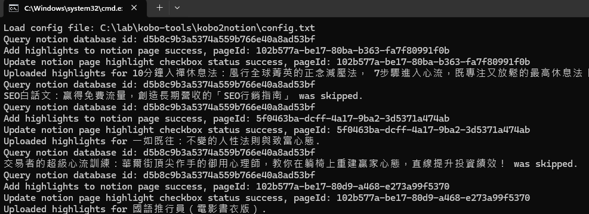

# Kobo2Notion


*Image generated using DALL·E.*

`kobo2notion` is a tool that automatically exports highlights from a Kobo eReader to a Notion database. This project includes a Windows batch file, a PowerShell script, and a simple configuration file to allow users to integrate their reading data with ease.

## Features

- Export Kobo highlights to a Notion database.
- Automatically find the corresponding book page in Notion and update the highlights and other book data such as publisher, author, ISBN.
- Supports batch processing for multiple books.
- Automatically installs missing PowerShell modules.
- Customizable Notion API token and database ID.

## Project Background

The initial inspiration for this project comes from the [export-kobo-to-notion](https://github.com/juliariec/export-kobo-to-notion) project on GitHub. The motivation behind `kobo2notion` was to create a solution that would seamlessly work on Windows without requiring the installation of additional tools like Python or Node.js. By using Windows batch files and PowerShell scripts, this project ensures ease of use and minimal setup for windows users.

## File Structure

- **kobo2notion.bat**: Windows Batch file that triggers the execution of the PowerShell script.
- **kobo2notion.ps1**: PowerShell script that reads the Kobo database and exports the highlights to Notion.
- **config.txt**: Configuration file containing the Notion API token, Notion database ID, and Kobo database path.

## Prerequisites

- Windows operating system
- PowerShell 5.1 or later
- Notion API token (you need to register your own Notion API Integration)
- Kobo database file (typically `KoboReader.sqlite`)
- Notion database setup with the following fields: Title(text), Author(text), Publisher(text), Synced(checkbox), Highlight Count(number), Sync Date(date), and ISBN(text).
  
## Installation and Usage

### 1. Download the Project

Download or clone the project to your local machine.

```bash
git clone https://github.com/akiraliu/kobo-tools.git
```

### 2. Edit `config.txt`

Fill in the following three parameters in the `config.txt` file:

- `notionToken`: Your Notion API token, which can be obtained from [Notion Integration](https://www.notion.so/my-integrations).
- `notionDatabaseId`: The ID of the target Notion database, found in the URL of the Notion database.
- `koboDatabasePath`: The path to your Kobo SQLite database, typically located at `<kobo-drive>\.kobo\KoboReader.sqlite`.

Example `config.txt`:

```
notionToken=your_notion_token_here
notionDatabaseId=your_notion_database_id_here
koboDatabasePath=C:\path\to\your\KoboReader.sqlite
```

### 3. Run `kobo2notion.bat`

In the project directory, double-click `kobo2notion.bat` or run it from the command prompt. The batch file will execute the PowerShell script and begin processing the Kobo highlights export.

```bash
kobo2notion.bat
```

### 4. Verify the Results

After execution, the Kobo highlights will be automatically updated in the specified Notion database. You can verify in Notion whether the book's highlights have been synced.

## Troubleshooting

- If the PowerShell script fails to run, ensure that the `ExecutionPolicy` is set to `Bypass`. You can set this in PowerShell by running the following command:

  ```powershell
  Set-ExecutionPolicy Bypass -Scope Process
  ```

- If a required module is missing, the script will automatically install the necessary PowerShell modules such as `PSSQLite`.

## Demo




## License

This project is licensed under the MIT License. For more details, see the [LICENSE](./LICENSE) file.
